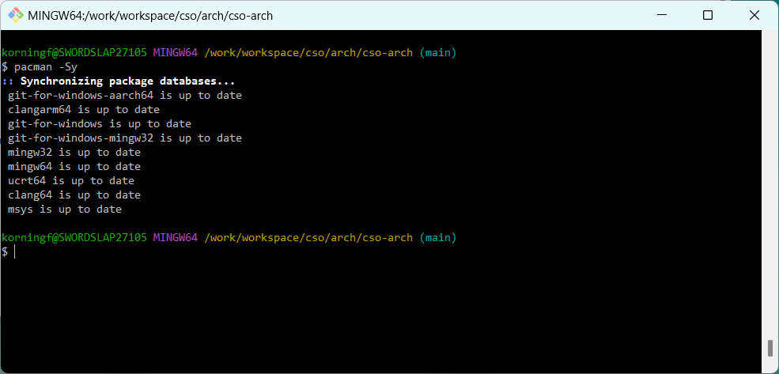

# git-win


git-win is a GitBash portable POSIX augmented with the MSYS2 PacMan package manager.




It is based on GitBash, based on MSysGit, based on Msys2, itself derived from Cygwin.

Now GitBash ports git and core-utils on Windows, but it is missing other needed tools.

Tools that are fundamental for build development, systems integration, and automation.

git-win provides a bare minimum environment to drive Cloud-Ops and Dev-Ops automation.


# Abstract

Different institutions or individuals vary widely in their desktop security practices.

Some may allow a full Cygwin POSIX distribution, others MSys, yet others merely GitBash.

We want a minimum POSIX environment for automation and integration on Windows Desktops.

.

For Automation, we need to authenticate, pull code from a repo, and run secure commands.

It should have, at minimum

- POSIX bash shell
- SSH Secure Shell
- GNU core utils
- package manager
- Git SCM

We will build up other systems on top of this.  git-win is the baremetal base box.


# Solution

We start with GitBash as baremetal base box, an atomic building block for other systems.

GitBash covers almost everything we need. The only thing missing is a package manager.

.

The key to getting this to work is to realise that underneath GitBash is a minimal MSys.

It is a pared-down MSys2 without a MinGW toolchain and without any package management.

.

Now MSys2 itself is built within SysGit / MSysGit, which has a full working environment.

We can clone its `pacman` package management facility and reintegrate it into gitbash.


# Preparation

*Depending on the institution or individual, this may or my not be an Administrator installation*.

*IMPORTANT Uninstall any other variants of GitBash, MSys, SysGit, Cygwin, or any GitForWindows*.


* Set powershell exevcution policy to bypass for the following scripts.

```pwsh
    Set-ExecutionPolicy Bypass -Scope Process -Force;
```


# Chocolatey


* a) *winget: (@skip - needs admin)*  

    winget install -e --id=Chocolatey.Chocolatey


* b) local user: (non-admin)

```pwsh
# Set directory for installation - Chocolatey does not lock
# down the directory if not the default
$InstallDir='C:\\ProgramData\\chocoportable'
$env:ChocolateyInstall="$InstallDir"


# All install options - offline, proxy, etc at
# https://chocolatey.org/install
iex ((New-Object System.Net.WebClient).DownloadString('https://community.chocolatey.org/install.ps1'))
```    


# SysInternals


* a) *winget default: (@skip - use custom)*

    winget install --id=Microsoft.Sysinternals.Suite -e


* b) *choco standard: (@skip - use custom)*

    choco install -y sysinternals


* c) choco custom: (@use-this! )

```pwsh
    mkdir -p c:\\syswin\\bin
    
    choco install -y sysinternals  --params "/InstallDir:c:\\syswin\\bin"
    
    setx SYSWIN "c:/syswin"
```


# GitBash

Our objective is to get a working `pacman` package manager and interpreted and compiled languages.

Modern package managers use SSL/TLS and GPG keyrings to securely pull packages from distributions.

The Git OpenSSL libraries must be able to talk to Windows Credential manager and pull certificates.

For this reason, on a managed desktop machine it is best to install Git with the default settings.


# GitBash


* a) *winget default: (@skip - use custom)*

    winget install --id Git.Git


* b) *choco standard: (@skip - use custom)*

    choco install -y git


* c) choco custom: (@use-this! )


```pwsh
    mkdir -p $env:APPDATA\\..\\Local\\Programs\\Git
    
    choco install -y git --force --params "/SChannel /Symlinks /PseudoConsoleSupport"

    junction c:/gitwin $env:APPDATA/../Local/Programs/Git
    setx MSYS "c:/gitwin  winsymlinks:native"
```


# Pacman

Next open a new `gitbash` shell and run `install-pacman.sh` for the initial setup.

This installs binaries, configures repos and keys, and installs the base packages.


* install pacman


```bash
./install-pacman.sh
```


# Operation


We can now run pacman normally.


# Interpreters

Automation will no doubt require a number of interpreted languages in addition to Bash Shell scripting.

Of particular interest are Perl, Ruby, Python, and Go, all of which are used in the common DevOps tools.

Gnu Core-utils ships with bash and perl; Pacman can be used to install the others, but python is tricky.


# Python

Python and pip in particular are very temperamental with mixed environments and mixed SSL/TLS bindings.

The Python pip package manager must be able to talk to Windows Credential manager to pull certificates.

For this reason, on a managed desktop, it is best to install a managed machine-scoped Python for Windows. 


* install python:


* a) install with choco:  (@fails - needs admin)

    choco install -y python


* b) winget system-wide:  (@fails - needs admin)

    winget install -e --id Python.Python.3.10 --scope machine


* c) winget user-space:  (@use-this! - local user)

    winget install -e --id Python.Python.3.13 --scope user
    


add local pip scripts and site-packages to your %PATH% :

```text
    %USERPROFILE%\AppData\Roaming\Python\Python310\Scripts
    %USERPROFILE%\AppData\Roaming\Python\Python310\Site-packages    
```


## stream processors


We will want some common file or stream processors: JQ (json), YQ (yaml), XQ (xml/xhtml/sgml/html).

JQ is a compiled Ansi-C binary and needs to be installed separately (currently blocked by scanner).

_TODO ask to unblock JQ._


install JQ by copying the binary:

_TODO Msys does not use /usr/local/bin - put it in /usr/bin for now_


```text
   curl -o jq.exe https://github.com/jqlang/jq/releases/download/jq-1.8.0/jq-windows-amd64.exe
   chmod a+x jq.exe
   mv jq.exe /usr/bin/
```


install the pip wrapper for JQ.  Also install XQ and YQ which are both native Python pip packages.


install JQ, XQ, and YQ pip packages:

```text
   pip install jq xq yq
```


# Cloud


Programmatic Cloud access is done through access-keys, aka access-tokens, and device-based MFA.

Multi-cloud federated SSO, with Azure and AWS, uses OIDC 2.x / OAuth 2.x and embeds JWT tokens.

At minimum we need the CLI command-line clients (azure-cli, aws-cli), and Hashicorp Terraform.


# IaC


IAC, or Infrastructure as Code, relies on CLI clients and allows us to query the infrastructure.

As much as possible we should avoid any proprietary cloud-native IaC (ex Bicep or CloudFormation),

a cloud-neutral IaC (Terraform or OpenTofu) should be sufficient as we will only do observability.


# Azure-cli


* a) *winget (@fails - needs admin)*

    winget install --id Microsoft.AzureCLI


* b) choco: (@fails - needs admin)  

    choco install -y azure-cli


* c) python: (@use-this!)  

    pip install azure-cli


# AWS-cli


* a) *winget (@fails - needs admin)*  

    winget install --id Amazon.AWSCLI


* b) choco: (@fails - needs admin)  

    choco install -y awscli


* c) python: (@use-this!)  

    pip install awscli


# Terraform ?


The default choco terraform edition will be the free terraform community edition.

It will not have support for Terraform Cloud (Repos hosted on Hashicorp HCP Cloud).

It is 100% OSS and free to use, but we may a local TF registry behind the firewall.


a) choco:

    choco install terraform --pre


# OpenTofu ?


An alternative is the OpenTofu fork.  to be investigated.

a) choco:

    choco install opentofu --source


# Attribution


This project is a fork of [git-win](https://github.com/korningf/git-win).


*Stephane Korning* (stefuss@yahoo.com) for the idea and impetus to port pacman to gitbash. 


*Andre Stenveld* for his simplified pacman installation 

[pacman-on-git-for-windows](https://gist.github.com/AndreSteenveld/cb6662c93c8323795c5fd347defb8976)


*Alex Sarmiento* and *David Gleba* for an actual implementation in their GitPortable-Pacman.

[gitportable-pacman](https://github.com/dgleba/gitportable-pacman)


*Johannes Schindelin* et-al for Git-For-Windows and its underlying git-sdk-64 (Herculean work!).

[git for windows](https://gitforwindows.org/install-inside-msys2-proper.html)


The host of developers having made *Git*, *Msys*, *Cygwin*, *MinGW*, *GNU* and *POSIX* possible.


# License

Creative-Commons,  Attribution, NonCommercial, ShareAlike 4.0


